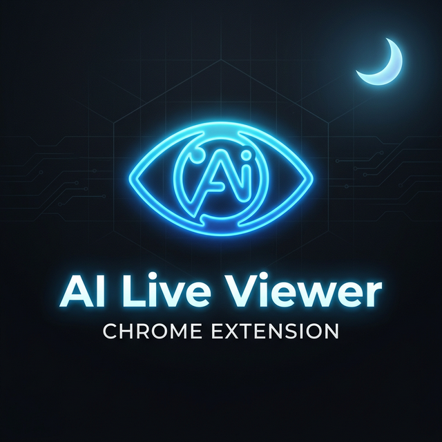
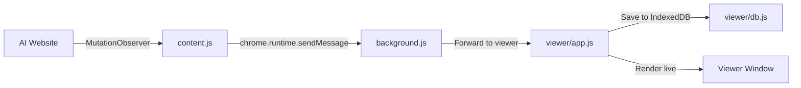

<p align="center">
  
</p>

# 🌙 AI Live Viewer

> **Built late at night by Damindu 🌙**

A powerful Chrome Extension that live-streams AI responses (DeepSeek, ChatGPT, Claude, Gemini) into a standalone, feature-rich viewer window with full editing, exporting, and history management.

---

## ✨ Features

| Feature | Description |
|---------|-------------|
| 🔴 **Live Streaming** | Watch AI responses render in real-time in a separate window |
| 🌓 **Light/Dark Mode** | Toggle between light and dark themes |
| 🔍 **Zoom Controls** | Zoom in/out for comfortable reading |
| 📝 **Editable Output** | Edit the AI response directly in the viewer |
| 📄 **PDF Export** | Export responses as clean PDF (white bg, black text) |
| 📋 **DOC Export** | Export responses as Word documents |
| 🗂️ **Chat History** | All chats auto-saved with IndexedDB (Dexie.js) |
| 📁 **Organized Sidebar** | Chats grouped by AI model → topic → responses |
| 🔽 **Expand/Collapse** | Collapsible folder tree for easy navigation |
| 🗑️ **Delete Chats** | Delete individual responses or entire chat sessions |
| 🇱🇰 **Sinhala Support** | Full Unicode & Sinhala font rendering in exports |
| 🖼️ **Image Handling** | Responsive image sizing, no overflow |

## 🤖 Supported AI Platforms

- **DeepSeek** — `chat.deepseek.com`
- **ChatGPT** — `chatgpt.com`
- **Claude** — `claude.ai`
- **Gemini** — `gemini.google.com`

## 📦 Installation

### From Source (Developer Mode)

1. **Clone the repository**
   ```bash
   git clone https://github.com/DaminduRat/ai-live-viewer.git
   ```

2. **Open Chrome Extensions**
   - Navigate to `chrome://extensions/`
   - Enable **Developer mode** (top-right toggle)

3. **Load the extension**
   - Click **"Load unpacked"**
   - Select the `ai-live-viewer-extension` folder

4. **Start using**
   - Go to any supported AI platform (DeepSeek, ChatGPT, etc.)
   - Click the extension icon in the toolbar
   - Start chatting — responses stream live to the viewer!

## 🏗️ Project Structure

```
ai-live-viewer-extension/
├── manifest.json          # Chrome Extension manifest (MV3)
├── background.js          # Service worker - manages viewer window
├── content.js             # Content script - observes AI responses
├── icons/                 # Extension icons
│   ├── icon16.png
│   ├── icon48.png
│   └── icon128.png
└── viewer/                # Standalone viewer window
    ├── index.html         # Viewer UI
    ├── styles.css         # Themes & styling
    ├── app.js             # Viewer logic, zoom, export
    ├── db.js              # IndexedDB via Dexie.js
    ├── dexie.min.js       # Dexie.js library
    └── html2pdf.bundle.min.js  # PDF generation library
```

## 🔧 How It Works



1. **content.js** injects into supported AI sites and observes DOM changes using `MutationObserver`
2. When AI starts generating a response, the HTML content is captured and sent to the **background service worker**
3. The service worker forwards the data to the **viewer window**
4. The viewer renders the content live and saves it to **IndexedDB** for history

## 📸 Usage

1. **Open an AI chat** (e.g., DeepSeek)
2. **Click the extension icon** — the viewer window opens
3. **Type a prompt** — watch the response stream live in the viewer
4. **Browse history** — expand/collapse chats in the sidebar
5. **Export** — click PDF or DOC to download
6. **Delete** — click ✕ to remove unwanted chats

## 🛠️ Tech Stack

- **Chrome Extension Manifest V3**
- **Vanilla JavaScript** — no frameworks
- **Dexie.js** — IndexedDB wrapper for chat storage
- **MutationObserver API** — real-time DOM observation
- **CSS Variables** — seamless theme switching

## 📄 License

MIT License — feel free to use, modify, and distribute.

---

<p align="center">
  <b>Built late at night by Damindu 🌙</b><br>
  <i>Because AI responses deserve a better view.</i>
</p>
